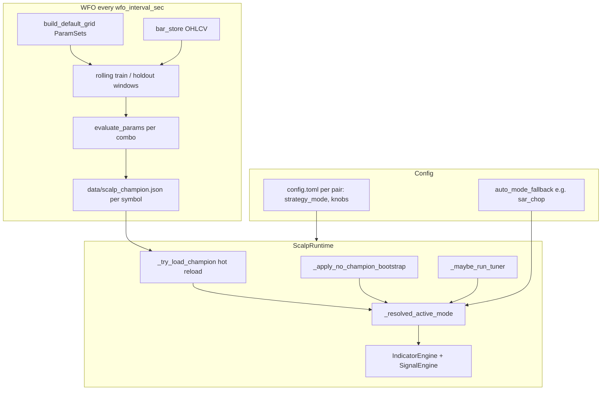

# Handoff: WFO champion vs param tuner — how strategy mode (“indicator”) is chosen

**Audience:** LLM or engineer working on `tradingbot-main` scalp bot  
**Date:** 2026-05-16  
**Scope:** How the bot picks **which registered strategy mode** runs live and how parameters are updated afterward.  
**Not in scope:** Per-mode detector math (see `strategies.md`, `REVIEW_HANDOFF_FOR_LLM.txt`, mode audits).

---

## Vocabulary (read this first)

| Term in code | What it means |
|--------------|----------------|
| **`strategy_mode`** | String on each pair in `config.toml` / `ScalpPairConfig`, e.g. `sar_chop`, `ema_momentum`, **`auto`**. |
| **Registered mode** | One of `WFO_REGISTERED_STRATEGY_MODES` in `scalp_vec_backtest.py` — each has `detect_signals_*` + `evaluate_params` branch. |
| **“Indicator” in operator language** | Usually means **the whole strategy mode** (entry rules + params), not a single TA line like RSI(14). |
| **Champion** | One WFO winner per **symbol** (not per pair_key), stored in `data/scalp_champion.json`. |
| **Bootstrap** | Short lookback pick when **no** champion row exists for that symbol. |
| **Param tuner** | Local one-knob-at-a-time refinement on **stored bars**; does **not** replace WFO’s grid search. |

There are **11** registered modes; the **default WFO grid** only searches a **subset** (see §4).

---

## Division of labor (one paragraph)

**WFO (`scalp_wfo.py`)** is the **coarse** layer: walk-forward over thousands of `ParamSet` combinations across several modes, score on **simulated round-trip trades**, write **`data/scalp_champion.json`** with winning **`mode` + params**. **Param tuner (`param_tuner.py`)** is the **fine** layer: every ~15 minutes (config), perturb **one tunable field at a time** for the **active** mode on recent bars and apply improvements to **`ScalpPairConfig` in memory**. While a champion exists, the tuner **does not change mode** unless `param_tuner_allow_mode_override_champion = true` (default **false**).

---

## End-to-end flow (runtime)



**Live signals** use `_resolved_active_mode(pair_key)` → `SignalEngine` dispatches to `_eval_<mode>` (e.g. `_eval_sar_chop`, `_eval_hull`). **Backtests** use the same mode string → `evaluate_params` → `detect_signals_*` + `simulate_trades_bidir` (or `simulate_trades_rsi` for `rsi_reversion`).

---

## 1. What WFO actually optimizes

### 1.1 Input data

- **Source:** `bar_store.load_bars(symbol, interval, last_n_days=…)` (`scalp_bot/bar_store.py`).
- **Span:** `wfo_effective_roll_span_hours(WFOConfig)` — train + holdout + rolling steps (see `config.toml`: `wfo_train_hours`, `wfo_holdout_hours`, `wfo_step_hours`, `wfo_max_roll_windows`).
- **Bars:** 5-minute candles by default (`ScalpPairConfig.interval`).

### 1.2 Parameter grid (which modes compete)

`build_default_grid()` in `scalp_vec_backtest.py` builds a large list of `ParamSet` rows. Each row has a **`mode`** field plus mode-specific integers/floats and shared risk fields (`atr_stop_mult`, `atr_tp_mult`, `max_hold_bars`, fees, `fill_model`).

**Included in default WFO grid today:**

| Mode | Grid sweeps (high level) |
|------|---------------------------|
| `daviddtech_scalp` | t3_length, adx_threshold, hold/stop/tp |
| `ema_momentum` | ema_fast/slow, hold/stop/tp (not unused rsi/vol slots) |
| `macd_scalp` | macd lengths, hold/stop/tp |
| `supertrend` | period, factor, hold/stop/tp |
| `hull_suite` | hull_period, hold/stop/tp |
| `rsi_reversion` | rsi thresholds, hold/stop |
| `sar_chop` | CHOP threshold/period, MA long, UT mult, PSAR steps, hold/stop/tp |
| `utbot_alert` | utbot_atr_period/mult, hold/stop/tp (restored 2026-05) |

**Still omitted from default grid** (restore in progress — see `HANDOFF_RESTORE_OFF_GRID_WFO_MODES.md`):  
`ema_scalp`, `squeeze_momentum`, `qqe_mod`.

### 1.3 Rolling windows

For each symbol WFO pass (`optimize_pair` in `scalp_wfo.py`):

1. Build `windows[]` = list of `(train_bars, holdout_bars)` via `rolling_windows()`.
2. **Train phase (per window):** For **every** grid index `pi`, run `evaluate_params(train, grid[pi], …)` → `BacktestMetrics`. Filter with `min_trades`, profit factor, win rate, max DD gates (`_gate_fail_reason`). Score survivors with `score_strategy(m, wfo_objective)` (repo default: **`total_pnl`** per `config.toml` `wfo_objective`).
3. Keep **top-K** train scores (`wfo_top_k`, default 80). After 11-mode grid expansion (~5k rows), **watch-first** — do not bump K until post-restoration WFO shows thin per-mode holdout pools; see `HANDOFF_RESTORE_OFF_GRID_WFO_MODES.md` § `wfo_top_k`.
4. **Holdout phase:** For each top-K index, run `evaluate_params` on **holdout** slice (with warmup prefix + `min_entry_bar` so indicators are warm — see `effective_min_bars_ready` / `_extend_holdout_with_warmup_prefix`). Require `min_holdout_trades` (default 1). Append `(score, metrics)` to `param_window_scores[pi]`.
5. **Aggregate across windows:** `_aggregate_holdout_candidates` — stability, mean holdout score, min fraction of windows (`wfo_min_window_fraction`), etc.
6. **Pick winner:** `_pick_holdout_champion` — highest mean holdout objective; tie-breakers from `wfo_holdout_tiebreakers` within `wfo_holdout_score_epsilon`.
7. **Safety / promotion gates:** param delta vs prior champion (`wfo_max_param_delta_stop/tp`), latest holdout PnL/PF, beat-prior score, champion cooldown, optional adverse re-score before save (`ScalpWFO.run_once`).

**Important:** WFO chooses **both** `params.mode` **and** the numeric fields on that `ParamSet`. The winning mode is **not** chosen in a separate pass — it wins only if some grid row with that `mode` survives train → holdout → aggregation.

### 1.4 Champion file shape

**Path:** `data/scalp_champion.json`  
**Shape:** `{ "<SYMBOL>": { champion_row }, ... }` e.g. `"BTC-PERP": { ... }`

**Key fields on each row** (see `optimize_pair` result dict ~line 1266):

| Field | Meaning |
|-------|---------|
| `symbol`, `interval` | Must match pair for apply (`champion_row_matches_pair_interval`) |
| `mode` | Winning registered mode string |
| `score` | Mean holdout objective used for ranking |
| `objective` | e.g. `total_pnl`, `sharpe` |
| `params` | Flat dict of ParamSet fields applied to `ScalpPairConfig` on reload |
| `holdout_metrics`, `holdout_metrics_mean` | Dashboard / logging |
| `wfo_mode_scoreboard` | Per-mode holdout summary for UI |
| `timestamp` | Promotion time |

**APIs:** `load_champion()`, `load_champion_for_symbol()`, `save_champion()`, `param_set_from_champion_row()`.

### 1.5 What `evaluate_params` does (scoring unit)

Single entry point: `scalp_vec_backtest.evaluate_params(bars, ParamSet, …)`:

1. Branch on `params.mode` → call matching `detect_signals_*` → `long_mask`, `short_mask`, `atr_vals` (+ extras for some modes).
2. Run trade simulator — almost always **`simulate_trades_bidir`**; **`rsi_reversion`** uses **`simulate_trades_rsi`** (long ATR TP, RSI exit).
3. `compute_metrics(trades, close, …)` → `BacktestMetrics` (PnL, win rate, Sharpe, expectancy, etc.).

WFO scores **closed trades after fees**, not “indicator pointed right without a trade.”

---

## 2. How the champion becomes live trading behavior

### 2.1 `strategy_mode = "auto"` on the pair

Resolution chain (`scalp_mode_resolution.resolve_auto_mode`):

1. If pair `strategy_mode` is **not** `auto` → use that string (manual pin).
2. If `auto` and champion row exists with valid `mode` → **champion mode wins**.
3. Else → `auto_mode_fallback` (global default `sar_chop` in `config.toml`).

`_resolved_active_mode(pair_key)` in `scalp_runtime.py`:

1. If open position → **lock** `_pair_entry_mode` (no mid-trade mode switch).
2. Else use `_active_mode[pk]` if set and not `auto`.
3. Else champion row for `pair_cfg.symbol` (interval match).
4. Else `resolve_auto_mode("auto", champion_row, fallback)`.

### 2.2 Applying champion on disk change

`_try_load_champion()` (watches mtime of `scalp_champion.json`):

- Sets `_champion_data` map.
- Per pair: if champion row matches symbol + interval:
  - **`_active_mode[pk] = entry["mode"]`**, `_mode_source[pk] = "wfo_champion"` (unless position open → queue `_pending_champion`).
  - **Mutates `ScalpPairConfig`** fields from `entry["params"]` (max_hold_bars, atr_*, mode-specific keys — list in `_try_load_champion` ~4256).

So after promotion, **live entries** use champion **mode** + champion **params** on the pair object.

### 2.3 No champion / WFO found nothing

- **`_apply_no_champion_bootstrap()`:** For symbols **without** a champion row, `best_mode_bootstrap_no_champion()` (`strategy_lookback.py`) backtests **all** `STRATEGY_MODES` on a **short** window (`risk_on_bootstrap_hours` / `NO_CHAMPION_BOOTSTRAP_HOURS`), ranks by **return_pct**, sets `_active_mode` and `_mode_source = "bootstrap"`.
- **`wfo_no_candidates_demotion_passes`:** After N WFO passes with no candidate, runtime can **demote** `wfo_champion` back to bootstrap (`_handle_wfo_no_candidates_streak`).

### 2.4 Warmup gate

If `warmup_require_champion`, trading stays blocked until a champion is seen **or** startup WFO completes (bootstrap allowed when WFO finishes with zero champions — see runtime warmup flags).

---

## 3. Param tuner — what it does after WFO

### 3.1 When it runs

`ScalpRuntime._maybe_run_tuner()`:

- Throttled by `param_tuner_interval_sec` (default **900**).
- Only in warmup phase **READY** (or DISABLED).
- Skips pair if `param_tuner_require_wfo_champion` and symbol has **no** champion row.
- Optional: `param_tuner_min_bars_between_runs`, `param_tuner_cooldown_sec_after_apply`.

Lookback for scoring: **`wfo_train_hours`** (same 7-day style window as WFO train — not holdout).

### 3.2 One cycle (`run_tuner_cycle`)

For each pair:

1. Load/slice bars from `bar_store` (last `lookback_hours`).
2. For each mode in `mode_list`:
   - Build `ParamSet` from **current** `ScalpPairConfig` via `_params_from_pair_config`.
   - `evaluate_params` → baseline metrics.
   - `tune_strategy_params`: perturb **one** parameter at a time from `TUNABLE_PARAMS[mode]` (ranges in `param_tuner.py`); keep change if **total PnL** improves (PF tie-break).
   - Re-score tuned params.
3. **Pick best mode** across modes by **expectancy** (min `EXPECTANCY_MIN_TRADES`), then PF, win rate, PnL — **only when tuning multiple modes**.

### 3.3 Champion present (default behavior)

When `pair_has_wfo_champion(champ, symbol, interval)`:

```python
modes_only = (eff_for_modes,)  # single tuple — active resolved mode only
```

- Tuner **only** perturbs params for **that** mode.
- **`champion_tuner_mode_resolution`:** keeps WFO mode unless `param_tuner_allow_mode_override_champion=true` and tuner’s `best_mode` differs → rare override path.

So: **WFO picks mode; tuner nudges knobs** on that mode (atr_stop, periods, thresholds, etc.). **`hull_period` is intentionally not in `TUNABLE_PARAMS`** (comment: TV-validated length).

### 3.4 No champion

- Tuner runs **all** `STRATEGY_MODES`.
- **`nemesis_resolve_bootstrap_vs_tuner`:** compares short bootstrap mode vs tuner’s best mode (expectancy / PF gates) → may set `_active_mode` from bootstrap or tuner (`_mode_source` tags: `nemesis_tuner`, `bootstrap`, etc.).

### 3.5 Applying tuner results

`apply_tuner_result(result, pair_cfg, apply_mode=effective_mode)`:

- Writes only **`params_changed`** from `result.all_modes[apply_mode]` into **`ScalpPairConfig`** attributes (does not write champion JSON).
- Skipped when aggressiveness is **frozen** (high PF + enough trades).

State debug: `data/scalp_tuner_state.json`.

---

## 4. Precedence table (who wins what)

| Question | Authority |
|----------|-----------|
| Which **mode** trades live (with champion)? | **WFO champion** `mode` → `_active_mode` / `resolve_auto_mode` |
| Which **mode** without champion? | **Bootstrap** and/or **Nemesis+tuner** (no WFO row) |
| Manual override? | Pair `strategy_mode` set to concrete mode (not `auto`) |
| Numeric **params** after champion load? | Champion `params` on reload + **tuner** deltas on `ScalpPairConfig` |
| Mid-position mode change? | **Blocked** until flat (`_pair_entry_mode`, pending champion queue) |

---

## 5. Key config knobs (`config.toml` `[scalp]`)

| Knob | Role |
|------|------|
| `wfo_enabled`, `wfo_interval_sec` | Periodic `ScalpWFO.run_once` |
| `wfo_train_hours`, `wfo_holdout_hours`, `wfo_step_hours`, `wfo_max_roll_windows` | Window geometry |
| `wfo_objective` | `score_strategy` metric (`total_pnl`, `sharpe`, …) |
| `wfo_top_k`, `wfo_min_trades`, `wfo_min_holdout_trades` | Train/holdout floors |
| `wfo_min_window_fraction`, `wfo_allow_promotion_relaxation` | Cross-window stability |
| `wfo_require_holdout_beat_prior`, `wfo_champion_cooldown_sec` | Promotion friction |
| `wfo_max_param_delta_stop/tp` | Limit jump vs prior champion |
| `auto_mode_fallback` | Mode when `auto` and no champion |
| `param_tuner_interval_sec`, `param_tuner_require_wfo_champion` | Tuner gating |
| `param_tuner_allow_mode_override_champion` | Default false — tuner must not steal mode from WFO |
| `strategy_mode` per pair | Often `"auto"` in TOML |

Per-pair blocks under `[[scalp.pairs]]` supply baseline knobs WFO/tuner start from before champion overwrite.

---

## 6. Code map (start here)

| Concern | File |
|---------|------|
| WFO loop, save champion, gates | `backend/server/scalp_bot/scalp_wfo.py` |
| Grid + `evaluate_params` + detectors | `backend/server/scalp_bot/scalp_vec_backtest.py` |
| Tuner perturbation / apply | `backend/server/scalp_bot/param_tuner.py` |
| Hot reload, tuner invoke, mode state | `backend/server/scalp_bot/scalp_runtime.py` |
| `auto` resolution | `backend/server/scalp_bot/scalp_mode_resolution.py` |
| Bootstrap / champion helpers | `backend/server/scalp_bot/strategy_lookback.py` |
| Live signals | `backend/server/scalp_bot/signal_engine.py`, `indicators.py` |
| Human spec | `strategies.md` |
| Champion on disk | `data/scalp_champion.json` |
| Promotion audit trail | `data/wfo_champion_promotions.jsonl` |

---

## 7. Scoring fidelity and champion history

**Default objective** (`wfo_objective`, typically `total_pnl`): every closed trade after fees on the holdout window. Anything that changes **trade count**, **exit price**, or **fees** in `evaluate_params` changes which `ParamSet` wins — not just “mode quality.”

Implications:

- A fix to **`simulate_trades_rsi`** or **`detect_signals_*`** can change scores for **all grid rows** of that mode and alter **runner-up** scores used by promotion gates (`wfo_require_holdout_beat_prior`, tie-break pools). Re-optimize is not limited to symbols that previously crowned that mode.
- **`cooldown_bars`** is fixed at `ParamSet` default **1** for every WFO grid row; it is **not** in `build_default_grid()` sweeps. Modes with **dense** entry masks (`hull_suite`: HMA state True on many bars) are especially sensitive — see `HANDOFF_DEFERRED_STATE_CLASSIFIER_COOLDOWN.md`.
- Modes **still off the default grid** (`ema_scalp`, `squeeze_momentum`, `qqe_mod`) cannot win `auto` champions until restored (`HANDOFF_RESTORE_OFF_GRID_WFO_MODES.md`). `utbot_alert` is on-grid as of 2026-05 cycle 1.

**Audit severity (recommended):** 🔴 = WFO scoring path for a mode in `build_default_grid`; 🟡 = manual-pin / hygiene / refactor; 🟢 = docs or perf only.

---

## 8. Common misconceptions

1. **“Tuner picks the strategy.”** — Usually **no** when a champion exists; it only tunes params for the champion mode. Without champion, Nemesis may pick between bootstrap and tuner’s multi-mode winner.
2. **“WFO optimizes RSI period for ema_momentum.”** — Grid may carry `rsi_period` on `ParamSet`, but `detect_signals_ema` **ignores** it; do not interpret WFO sweeps on dead fields.
3. **“Champion is per pair_key.”** — File is keyed by **symbol**; two pairs same symbol share one champion row.
4. **“Holdout score equals live PnL.”** — Holdout is simulated with `backtest_fill_model`, fees, optional funding flags; live has fills, partials, forward demotion (`wfo_forward_*` gates).
5. **“All 11 modes compete every WFO pass.”** — Only modes present in `build_default_grid()` combinations compete unless grid is expanded.

---

## 9. Deferred / related (see `REVIEW_HANDOFF_FOR_LLM.txt`)

- **`ema_scalp` WFO vs live exit mismatch** (S/R stops live, ATR bidir in WFO).
- **Per-mode detector audits** (parity with Pine) — separate from selection logic.
- **`hull_no_long_flip` log rename** — cosmetic.

---

## 10. Suggested reading order for a new LLM

1. This file (selection logic).  
2. [`HANDOFF_AUDIT_SELECTION_PATH_ADDENDUM.md`](HANDOFF_AUDIT_SELECTION_PATH_ADDENDUM.md) — cross-mode findings (X1–X7, Y1–Y4), path tags, counter-exit asymmetry, final status table.  
   [`HANDOFF_RESTORE_OFF_GRID_WFO_MODES.md`](HANDOFF_RESTORE_OFF_GRID_WFO_MODES.md) — restore 4 omitted modes to WFO grid (rollout).  
3. `strategies.md` — what each mode’s entries/exits mean.  
4. `scalp_wfo.py` module docstring + `optimize_pair` + `ScalpWFO.run_once`.  
5. `param_tuner.py` module docstring + `run_tuner_cycle` + `_maybe_run_tuner`.  
6. `scalp_runtime.py` — `_resolved_active_mode`, `_try_load_champion`, `_maybe_run_tuner`.  
7. One trace: grep `evaluate_params` for your mode, then `SignalEngine._eval_<mode>`.
