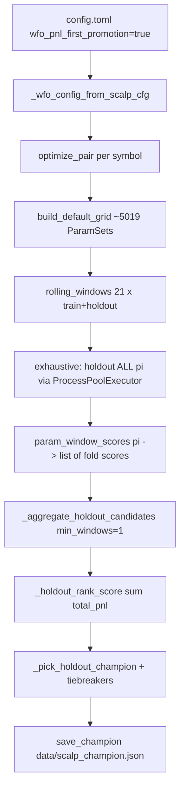

# Handoff: WFO period ranking + exhaustive grid holdout (2026-05-18)

**Audience:** LLM or engineer cross-checking recent WFO promotion changes  
**Repo:** `tradingbot-main`  
**Primary scope:** Walk-forward optimizer champion selection — **not** live indicator wiring, protective orders, or Coinbase margin fixes (those are separate; see §8).

---

## 1. User requests (chronological)

| # | User concern | What they wanted |
|---|----------------|------------------|
| 1 | WFO not promoting champions after indicator/grid work | Confirm or refute whether **indicator wiring** caused `no_candidates_after_stability_filters` |
| 2 | `wfo_min_window_fraction` | Does **0.35** make sense? Why do **all 11 modes** look like losers? |
| 3 | Promotion philosophy | Judge **best performance over the evaluation period**, not “same param row must score on 7/21 daily folds” |
| 4 | Full grid | **Exhaustive backtest of every grid row**; **best performer wins** (not train top‑80 funnel) |

This handoff documents the **code changes for #3 and #4**, and the **investigation conclusions for #1–#2** that motivated them.

---

## 2. Investigation conclusions (cross-check before blaming indicators)

### 2.1 Indicator wiring was **not** the root cause of failed promotion

Evidence from `data/session_20260518_114451.jsonl` (startup WFO, pre-change):

| Field | Typical value | Meaning |
|-------|----------------|---------|
| `skip_reason` | `no_candidates_after_stability_filters` | **Misleading log label** — see below |
| `grid_size` | 5019 | Full 11-mode grid loaded |
| `n_pi_any_holdout` | 375–483 | Hundreds of grid indices had ≥1 holdout score |
| `holdout_hit_rank` top | 5–6 `holdout_windows` | Best rows hit holdout on 5–6 folds |
| `min_windows_primary` | 7 | `int(21 × 0.35)` from `wfo_min_window_fraction` |

**Conclusion:** Backtests **did** produce OOS trades across modes. Failure was the **promotion rule** (need 7 fold hits for the **same** `pi`), not dead detectors.

With `wfo_pnl_first_promotion = true`, stability / mean-PnL gates were already relaxed in `_wfo_config_from_scalp_cfg`; the blocker was **`len(window_results) < min_windows`** in `_aggregate_holdout_candidates`.

### 2.2 Why “all 11 modes failed” was misleading

WFO crowns one **grid index** (`pi`) = mode **plus** full param bundle. It does **not** crown “best mode family.”

- Grid is **imbalanced:** `sar_chop` ≈ 2304 / 5019 rows (~46%); other modes ≈ 96–540 rows (`build_default_grid()`).
- **Top‑80 per fold** favored high train scorers; the same `pi` rarely appeared on **7** different days.
- Modes **did** appear in holdout diagnostics (e.g. XRP: `squeeze_momentum`, `daviddtech_scalp`, `sar_chop` in top holdout hits).

### 2.3 `wfo_min_window_fraction = 0.35` — sensible intent, wrong pairing

- **Intent:** Require cross-regime stability (~⅓ of rolling OOS days).
- **Problem when paired with top‑80 + 5k grid:** Best rows stopped at **6/7** folds — one short of promotion — while still having hundreds of holdout-scoring indices.

**After this change set:** When `wfo_pnl_first_promotion = true`, `min_window_fraction` is forced to **0.0** → `min_windows = 1` for aggregation; ranking uses **period total PnL**, not fold-count.

---

## 3. What was implemented (two layers)

Both layers activate when **`wfo_pnl_first_promotion = true`** (via `_wfo_config_from_scalp_cfg` in `scalp_runtime.py`). Config can also set flags explicitly.

### Layer A — Period holdout ranking (`holdout_rank_by_period`)

| Before | After |
|--------|--------|
| Champion pool: mean holdout score per fold; need ≥ `int(N × wfo_min_window_fraction)` folds | Pool: any `pi` with ≥1 holdout fold; **rank by sum of `total_pnl`** across folds |
| Log: `no_candidates_after_stability_filters` | Failure log: `no_candidates_after_period_holdout_gates` when period mode |
| `score` on champion ≈ mean holdout objective | `score` ≈ **sum** holdout USD; also `sum_holdout_total_pnl` on champion JSON |

**Rationale:** User: *“choose the best PERFORMING over that period, not #1 for the entire period”* — meaning cumulative OOS performance, not daily top‑K consistency.

**Floor:** `wfo_min_period_holdout_trades` (default **3**) = minimum **total** closed holdout trades summed across folds (avoids one-lucky-day winners).

### Layer B — Exhaustive grid holdout (`exhaustive_grid_holdout`)

| Before | After |
|--------|--------|
| Per fold: train all grid → **top‑80** → holdout only top‑80 | Per fold: **holdout all 5019 rows** (train skipped) |
| ~5019 train + 80×21 holdout evals per pair | ~5019×21 holdout evals per pair (train removed) |

**Rationale:** User: *“full grid, exhaustive backtest of each strategy; the best performing wins.”*

**Note:** Still **rolling WFO** (21 × 24h OOS slices). Period performance = **sum of holdout PnL** over those slices, not one concatenated 28-day `evaluate_params` call. Equivalent for “total OOS $ over the roll” given disjoint holdout windows.

---

## 4. End-to-end flow (current, pnl-first + exhaustive)



**Promotion tier string:** `exhaustive_period_holdout_total` when both flags on.

---

## 5. File map and code anchors

### 5.1 Configuration

| File | What to check |
|------|----------------|
| `config.toml` ~L409–417 | `wfo_pnl_first_promotion`, `wfo_exhaustive_grid_holdout`, `wfo_min_period_holdout_trades`, `wfo_objective` |
| `config.toml` ~L435–437 | `wfo_min_window_fraction` — **ignored** when pnl-first (comment added) |
| `backend/server/scalp_bot/scalp_config.py` | `ScalpBotConfig` fields + TOML loader for new keys |
| `backend/server/scalp_bot/scalp_runtime.py` | `_wfo_config_from_scalp_cfg()` — **single place** pnl-first overrides are applied |

**Critical override block** (`scalp_runtime.py`, ~L179–201):

```python
if bool(getattr(cfg, "wfo_pnl_first_promotion", False)):
    wfo = dataclasses.replace(
        wfo,
        objective="total_pnl",
        require_positive_latest_holdout=False,
        min_latest_holdout_pf=0.0,
        min_mean_score=-999.0,
        min_stability_ratio=-999.0,
        max_avg_dd_pct=999.0,
        require_holdout_beat_prior=False,
        max_param_delta_hold=10_000,
        max_param_delta_stop=1_000.0,
        max_param_delta_tp=1_000.0,
        holdout_rank_by_period=True,
        exhaustive_grid_holdout=bool(getattr(cfg, "wfo_exhaustive_grid_holdout", True)),
        min_window_fraction=0.0,
        min_period_holdout_trades=max(0, int(getattr(cfg, "wfo_min_period_holdout_trades", 3) or 0)),
    )
```

**Cross-check:** `wfo_require_holdout_beat_prior = true` in TOML does **not** apply to WFO pass when pnl-first (override sets `require_holdout_beat_prior=False` on `WFOConfig`). Post-optimize save gates in `ScalpWFO.run_once` also skip beat-prior when pnl-first (~L1836 in `scalp_wfo.py`).

### 5.2 Core WFO logic

| File | Symbols | Lines (approx) |
|------|---------|----------------|
| `scalp_wfo.py` | `WFOConfig` new fields | ~229–236 |
| `scalp_wfo.py` | `_mp_holdout_eval_one` | ~111–130 |
| `scalp_wfo.py` | `_holdout_grid_indices` | ~133–145 |
| `scalp_wfo.py` | `_holdout_rank_score` | ~496–504 |
| `scalp_wfo.py` | `_min_holdout_windows_from_fraction` → 1 if period rank | ~489–493 |
| `scalp_wfo.py` | `_aggregate_holdout_candidates` uses `rank_score` | ~274–312 |
| `scalp_wfo.py` | `optimize_pair` exhaustive branch | ~1026–1075 |
| `scalp_wfo.py` | `optimize_pair` non-exhaustive (legacy top-K) | ~1077+ |
| `scalp_wfo.py` | Champion `result` dict extras | ~1448–1450 |
| `scalp_vec_backtest.py` | `build_default_grid()` | ~3559+ (5019 rows, 11 modes) |
| `scalp_wfo.py` | `indicator_warmup.effective_min_bars_ready` + `_extend_holdout_with_warmup_prefix` | holdout warmup unchanged |

### 5.3 New `WFOConfig` fields

```python
holdout_rank_by_period: bool = False      # sum holdout total_pnl for ranking
min_period_holdout_trades: int = 0        # min sum of holdout trades across folds
exhaustive_grid_holdout: bool = False     # holdout every grid row; skip train funnel
```

### 5.4 Key functions (behavior)

**`_holdout_grid_indices(wfo_cfg, train_scores, grid_len)`**

- `exhaustive_grid_holdout=True` → `list(range(grid_len))` (all rows).
- Else → top `wfo_cfg.top_k` from `train_scores`.

**`_holdout_rank_score(wfo_cfg, scores, metrics_list)`**

- If `holdout_rank_by_period` and `objective == "total_pnl"` → `sum(m.total_pnl)`.
- Else → `mean(scores)` (legacy).

**`_aggregate_holdout_candidates`**

- Drops `pi` with `len(window_results) < min_windows` (now **1** under pnl-first).
- Drops `pi` if `sum(trade_count) < min_period_holdout_trades` when period ranking on.
- Appends `(rank_score, stability, pi, metrics_list)` — first element is what `_pick_holdout_champion` maximizes.

**`_mp_holdout_eval_one`**

- Worker: warmup prefix + `evaluate_params(..., min_entry_bar=n_prefix)` on holdout slice.
- Returns error if `trade_count < holdout_trade_floor` (config: `wfo_min_holdout_trades` = 1).

### 5.5 Tests (run for regression)

```bash
cd backend/server/scalp_bot
python -m pytest test_wfo_pnl_first_promotion.py test_wfo_holdout_tiebreak.py -q
```

| Test | Asserts |
|------|---------|
| `test_wfo_pnl_first_forces_total_pnl_and_relaxes_gates` | Overrides + period + exhaustive flags |
| `test_holdout_grid_indices_exhaustive_is_full_grid` | All 5019 indices |
| `test_period_rank_prefers_total_pnl_over_fold_count` | Sum $12 beats 7 folds × $1 |
| `test_wfo_pass_config_no_vol_overlay_when_pnl_first` | Vol-armed overlay skipped |

### 5.6 Observability

| Artifact | Fields |
|----------|--------|
| JSONL `wfo_pair_result` / `wfo_pass_complete` | `skip_reason`, `wfo_diag`, `min_windows_primary`, `holdout_hit_rank`, `n_pi_any_holdout` |
| `data/scalp_champion.json` | `wfo_promotion_tier`, `holdout_rank_by_period`, `exhaustive_grid_holdout`, `sum_holdout_total_pnl`, `windows_passed` |
| Logs | `exhaustive holdout: N workers × 5019 grid × 21 windows` |

**Legacy skip reason** `no_candidates_after_stability_filters` may still appear in **old** session files; new failures should use `no_candidates_after_period_holdout_gates` or `no_holdout_scores_in_grid` (exhaustive, zero scorers).

---

## 6. Config reference (production intent)

```toml
wfo_pnl_first_promotion = true
wfo_exhaustive_grid_holdout = true
wfo_min_period_holdout_trades = 3
wfo_objective = "total_pnl"
wfo_min_holdout_trades = 1          # per-fold floor (each 24h OOS slice)
wfo_top_k = 80                      # IGNORED when exhaustive=true
wfo_min_window_fraction = 0.35      # IGNORED when pnl-first (forced 0 → min_windows=1)
wfo_allow_promotion_relaxation = false
```

### Disabling layers independently

| Goal | Settings |
|------|----------|
| Period sum PnL only, keep top‑80 funnel | `wfo_exhaustive_grid_holdout = false`, keep pnl-first |
| Legacy fold-count + top‑80 | `wfo_pnl_first_promotion = false` |
| Full grid but legacy mean-score ranking | Not wired — would need `holdout_rank_by_period=false` while exhaustive=true (non-default) |

---

## 7. Cross-check checklist for reviewer

1. **`_wfo_config_from_scalp_cfg`** — Confirm all three flags set when `wfo_pnl_first_promotion=true`.
2. **`optimize_pair` exhaustive branch** — Train loop skipped (`continue` after holdout); no double evaluation.
3. **`_aggregate_holdout_candidates`** — With period rank, candidate with 6 folds × $2 beats 7 folds × $1 (unit test).
4. **Champion `score` units** — New champions use **sum** holdout PnL; old disk champions may have **mean** scores (~−2.35). Beat-prior disabled under pnl-first; cooldown still applies.
5. **CPU** — ~5019 × 21 holdout evals × 3 pairs per WFO pass; parallelized via `ProcessPoolExecutor` (`_WFO_WORKER_COUNT = cpu_count - 1`).
6. **Indicator alignment** — Holdout still uses `effective_min_bars_ready` + `_extend_holdout_with_warmup_prefix` (unchanged); live `IndicatorSet` path not modified by this work.
7. **Restart required** — Bot must reload code/config; WFO on interval or startup warmup.

### Manual smoke (optional)

```python
from scalp_bot.scalp_vec_backtest import build_default_grid
grid = build_default_grid()
assert len(grid) == 5019
from collections import Counter
print(Counter(p.mode for p in grid))  # sar_chop dominant
```

---

## 8. Out of scope (same conversation, different PRs)

Do **not** attribute these to the WFO promotion change unless explicitly reviewing full session:

| Topic | Files |
|-------|--------|
| Coinbase `PREVIEW_INSUFFICIENT_FUNDS` / protective stacking | `coinbase_order_manager.py`, `scalp_trader.py`, `scalp_runtime.py` |
| Indicator warmup sync / `indicator_warmup.py` | Unchanged by WFO promotion PR |
| Prior conversation transcript | `agent-transcripts/497478b0-e94a-4ad6-8915-5f3a07febcff.jsonl` |

---

## 9. Related docs

| Doc | Use |
|-----|-----|
| `pine/HANDOFF_WFO_CHAMPION_AND_PARAM_TUNER.md` | General WFO vs param tuner (pre-period-rank; update if promoting this handoff to canonical) |
| `pine/HANDOFF_RESTORE_OFF_GRID_WFO_MODES.md` | 11-mode grid restoration, `wfo_top_k` guidance |
| `research_wfo-gates/report.md` | External research on fold-count gates vs industry WFO |

---

## 10. Known limitations / future work

1. **Not a single backtest over one OOS block** — Still 21 rolling 24h holdouts; sum of PnL is the period metric. True single-span eval would need new bar-slicing in `optimize_pair`.
2. **Per-fold trade floor** — Rows with 0 holdout trades on a fold contribute nothing that day but can still win on total sum if other folds trade.
3. **Grid imbalance** — `sar_chop` has more rows; exhaustive mode gives every row equal **chance**, not equal mode probability.
4. **`wfo_require_positive_holdout` in TOML** — Overridden off on `WFOConfig` for latest-window check when pnl-first; latest-window PnL/PF gates in `optimize_pair` (~L1201+) are skipped via `require_positive_latest_holdout=False`.
5. **Score comparability** — Promotions after this change use sum PnL; comparing `score` to pre-change champions on disk is not apples-to-apples.

---

## 11. Summary sentence for sign-off

**User asked for period-best and full-grid OOS evaluation; implementation enables exhaustive holdout on all ~5019 param sets × 21 folds, ranks by summed holdout `total_pnl` with a minimum of 3 total OOS trades, and removes the 7/21 fold-count promotion bar when `wfo_pnl_first_promotion` is true. Earlier “no champion” behavior was diagnosed as promotion gating, not indicator failure.**
