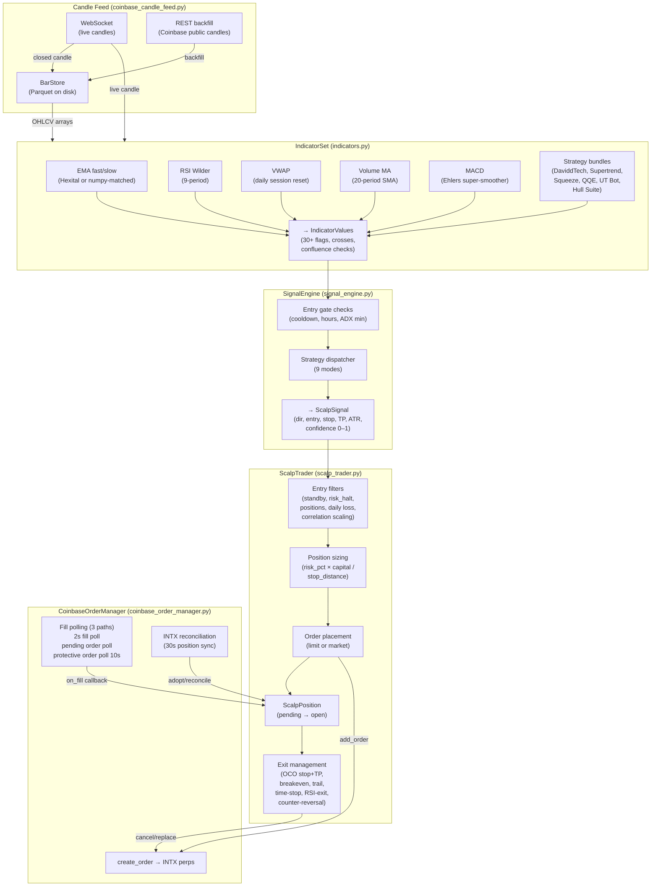
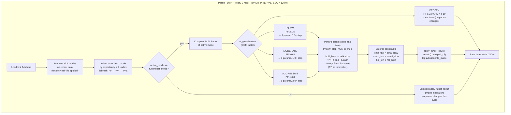
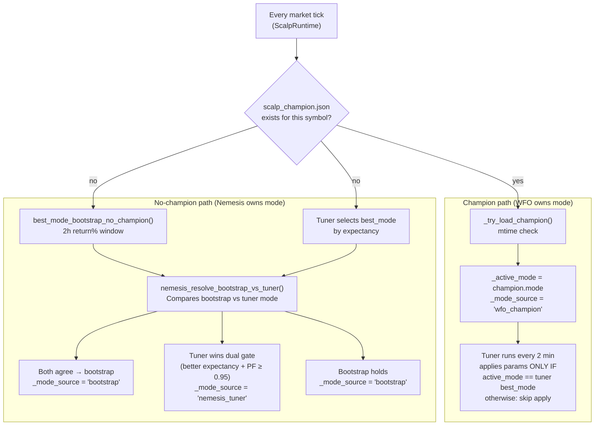
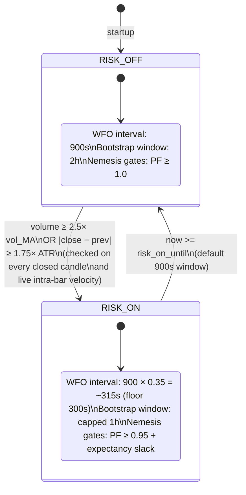
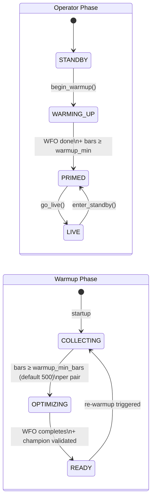
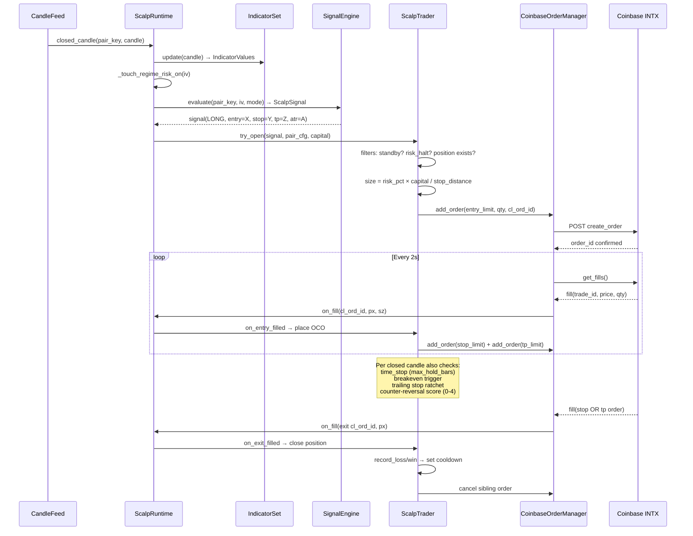
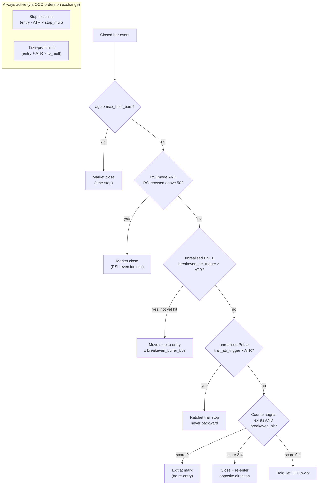

# Scalp Bot: How It Works in Practice
**Research date:** 2026-04-09  
**Verified against:** config.toml, scalp_runtime.py, scalp_wfo.py, scalp_trader.py, param_tuner.py

---

## Answer (3-sentence summary)

The scalp bot is a three-layer adaptive system: a Walk-Forward Optimizer (WFO) runs every **15 minutes** (config: `wfo_interval_sec = 900`) to select the best strategy mode + params across 9 candidate strategies using rolling **24h train / 8h holdout** windows, writing a champion JSON that is hot-reloaded into the live process with zero downtime. A param tuner runs every **2 minutes** (`_TUNER_INTERVAL_SEC = 120.0`) to locally refine indicator settings within the active mode — but *only applies changes when its own internal best-mode ranking matches the currently active mode*; otherwise the cycle is a no-op for execution. A regime detector watches for volume spikes and ATR moves; when triggered it accelerates WFO by 2.85× (floor 300s), compresses the bootstrap window, and relaxes Nemesis quality gates — so the bot self-tunes faster under volatile conditions.

---

## Architecture Overview



---

## Self-Adjusting Layer 1: Walk-Forward Optimizer

**Config (config.toml):** `wfo_interval_sec = 900`, `wfo_train_hours = 24`, `wfo_holdout_hours = 8`, `wfo_step_hours = 4`  
**Bar load span:** `total_hours = 24 + 8 + (4×3) = 44h` → `load_days ≈ 2.3 days`

```mermaid
flowchart TD
    subgraph WFO["ScalpWalkForwardOptimizer — every 15 min (risk_off) / ~5 min (risk_on, floor 300s)"]
        LOAD["Load ~2.3 days of bars\nfrom BarStore"]
        WINDOWS["Generate rolling windows\nWindow 1: Train h0–h24 → Holdout h24–h32\nWindow 2: Train h4–h28 → Holdout h28–h36\nWindow 3: Train h8–h32 → Holdout h32–h40\n(steps by 4h, needs ≥50 train / ≥20 holdout bars)"]
        GRID["Build parameter grid\n~1000 combinations × 9 modes\n(atr mults, hold bars, EMA periods,\nRSI, MACD, indicator-specific params)"]
        TRAIN["Evaluate each combo on TRAIN\nwith recency half-life = n_bars / 3\n(newer trades weighted more)"]
        GATES["Hard gates per window\nPF ≥ 0.8 · WR ≥ 20% · DD ≤ 30% · n ≥ 3"]
        TOP50["Top-K=50 survivors\nvalidated on HOLDOUT split"]
        AGG["Aggregate across windows\nStability filter: mean/std ≥ 0.15\nCoverage: must appear in ≥50% of windows\nPick highest mean Sharpe"]
        SAFETY["Safety gate\n|Δhold_bars| ≤ 24\n|Δstop_mult| ≤ 0.5×\n|Δtp_mult| ≤ 1.0×\nNew score > baseline on latest holdout"]
        WRITE["Write scalp_champion.json\n(atomic temp-file swap)"]
        MTIME["ScalpRuntime sees new mtime\non next tick"]
        APPLY["_try_load_champion()\nsetattr() params onto pair_cfg\nswitch _active_mode if changed\nno restart needed"]
    end

    LOAD --> WINDOWS --> GRID --> TRAIN --> GATES --> TOP50 --> AGG --> SAFETY --> WRITE --> MTIME --> APPLY
```



**What gets written to champion.json per symbol:**
- `mode` — one of 9 strategy names
- `params` — 25–45 indicator/risk settings
- `holdout_metrics` — trade count, win rate, PnL, Sharpe, PF, expectancy, max DD
- `score`, `stability`, `windows_passed` — audit trail

---

## Self-Adjusting Layer 2: Param Tuner

**Cadence:** every **2 minutes** (`_TUNER_INTERVAL_SEC = 120.0`, `scalp_runtime.py:70`)  
**Critical gate:** `apply_tuner_result` only fires when `active_mode == result.best_mode` (`scalp_runtime.py:467–481`).  
If the tuner's internal grid picks a *different* mode than the one currently executing, the cycle produces no param changes for that round — even if improvements were found. This is logged as `skip apply_tuner_result — active_mode=X tuner_cycle_best=Y`.



---

## Mode Authority: Who Controls active_mode

This is the most nuanced part of the system. Two separate paths set `_active_mode`:



**Key distinction:** "Tuner never switches mode" is only true when a WFO champion exists. Without a champion, Nemesis uses tuner output as one of two inputs to set `_active_mode`.

---

## Self-Adjusting Layer 3: Regime Detection & Acceleration



**What regime does NOT do:** It does not gate entries or change position size directly. It is purely a WFO/bootstrap acceleration lever.

---

## Warmup & Operator State Machines



- **Entries blocked** until operator phase = LIVE AND warmup phase = READY
- **WFO triggered once** bar threshold met during COLLECTING
- **Forced graduation** at `warmup_max_hours` timeout (if set)

---

## End-to-End Signal → Fill Flow



---

## Exit Decision Tree



---

## The Closed Learning Loop

```mermaid
flowchart LR
    LIVE["Live trading\n(pair_cfg params active)"]
    BARS["BarStore\n(rolling Parquet)"]
    WFO2["WFO\n(every 15 min, config: 900s)"]
    CHAMPION["scalp_champion.json"]
    TUNER2["Param Tuner\n(every 2 min)"]
    REGIME2["Regime detector\n(every bar)"]
    BOOTSTRAP2["Nemesis / Bootstrap\n(no-champion fallback)"]

    LIVE -->|fills candles| BARS
    BARS -->|~2.3-day window| WFO2
    WFO2 -->|writes| CHAMPION
    CHAMPION -->|hot-reloads via mtime| LIVE
    BARS -->|24h window| TUNER2
    TUNER2 -->|setattr() IF mode matches| LIVE
    LIVE -->|indicators| REGIME2
    REGIME2 -->|WFO interval × 0.35, floor 300s| WFO2
    BARS -->|2h lookback| BOOTSTRAP2
    BOOTSTRAP2 -->|sets active_mode when no champion| LIVE

    style LIVE fill:#1a6b3a,color:#fff
    style WFO2 fill:#1a3b6b,color:#fff
    style TUNER2 fill:#6b3b1a,color:#fff
    style REGIME2 fill:#6b1a3b,color:#fff
```

---

## Non-Obvious Design Decisions (verified from code)

| Decision | Why it matters |
|---|---|
| **EMA cross required, not trend** (`signal_engine.py:826`) | Pure trend fires every bar in mild drift → whipsaws. Cross = timing edge, once per shift |
| **MACD scaled ×1e7** (`indicators.py:510`) | Raw Ehlers MACD is ~0.00001; scaling prevents float precision loss in cross detection |
| **Recency half-life = n_bars/3** (both WFO and tuner) | Older trades decay geometrically; implicit regime adaptation without explicit detection |
| **Stability filter mean/std ≥ 0.15** (loose) | Crypto is volatile; tighter thresholds reject ALL strategies in choppy periods |
| **Tuner uses PF, not win rate** | PF(2.0) = $2 won per $1 lost regardless of WR; magnitude > frequency in crypto |
| **Reversal only if breakeven_hit** (`scalp_trader.py:905`) | Never chase a counter-signal at a loss; cost-basis must be protected first |
| **Regime accelerates WFO, not entries** | Entry gating stays clean; faster re-optimization is the response to volatility |
| **Bootstrap ranks by return%, not expectancy** | Bootstrap is regime-aware; recent absolute return > statistical edge on small samples |
| **Tuner apply gate: active_mode == tuner best_mode** (`scalp_runtime.py:467`) | Prevents param desync if Nemesis holds a mode the tuner grid doesn't favour; logs all mismatches |
| **3 independent fill detection paths** | Coinbase get_fills() can miss fills at >100 concurrent; safety net prevents orphan positions |

---

## Open Questions (grounded in code)

1. **Tuner apply gap when modes diverge:** When `active_mode ≠ tuner best_mode`, the tuner produces no param improvements that cycle — including potential improvements for the *active* mode. If logs show frequent `skip apply_tuner_result` while a champion is active, this is worth evaluating: either document "apply only when winner matches active mode" as an intentional product rule, or consider always scoring the active mode separately and applying its improvements regardless of the global grid winner.

2. **WFO floor 300s in risk-on** (`config.toml:320`): Regime scales interval to ~315s but floor is 300s — effectively no acceleration at the boundary. At 15-min candles, 300s = 1/3 of a bar. Real question is whether 300s is fast enough to catch a regime shift before the next significant move.

3. **Daily loss limit resets on restart** (`scalp_trader.py:113, 1283`): `_daily_pnl` is in-memory only. `reset_session()` zeroes it. A crash-and-restart mid-day resets the accumulator, allowing the loss limit to be exceeded across the session boundary. If this is a hard safety property, it needs persistence + rehydration on startup.

4. **Correlation group scaling** (unverified this pass): Not traced in detail. Noted as a candidate for future verification before drawing conclusions.
